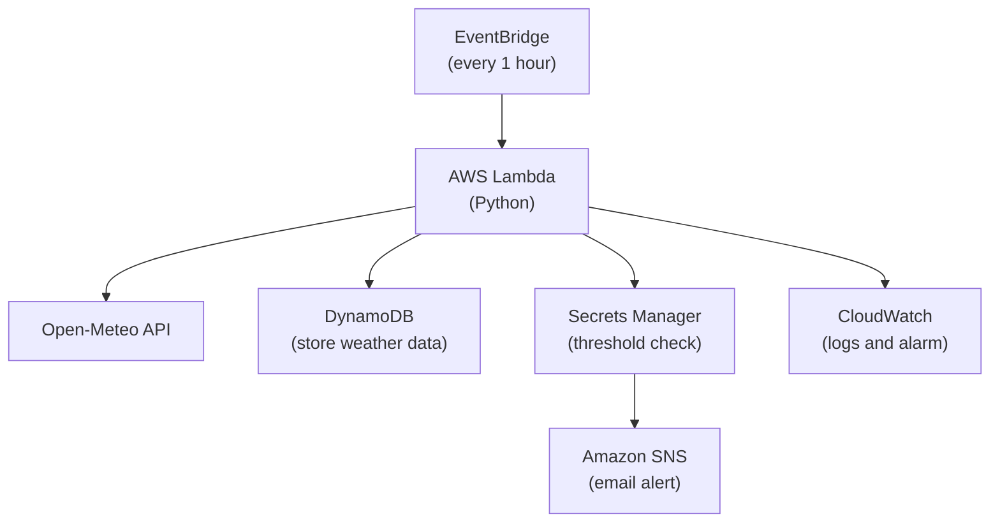

# Architectural Diagram

## Three Decision Table

| Decision | What We Chose | What We Rejected | Pillar | Justification |
|---|---|---|---|---|
| Database | DynamoDB on-demand | RDS PostgreSQL | Cost | RDS wins on ad-hoc SQL queries but incurs idle instance cost; DynamoDB pay-per-request fits the $100 Learner Lab budget. |
| Compute | AWS Lambda | EC2 / ECS | Cost + Operational Excellence | No server patching and no idle EC2 cost; the Lambda free tier covers our load. |
| API | Open-Meteo | OpenWeatherMap | Cost | OpenWeatherMap requires an API key and has a rate-limited free tier; Open-Meteo is 100% free with no signup. |

## Architecture Review Findings

| Finding | Accept / Push Back | One-line Response |
|---|---|---|
| No retry logic if Open-Meteo fails | Accept | Valid — API downtime would drop a data point with no recovery. |
| SNS email is best-effort, not guaranteed delivery | Push back | Acceptable for the capstone demonstration; SNS email is sufficient for demonstration. |
| Secrets Manager is overkill for a single integer threshold | Push back | Using Lambda environment variables would require redeployment to change the threshold; Secrets Manager allows runtime updates. |
